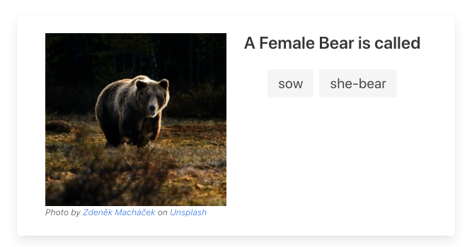
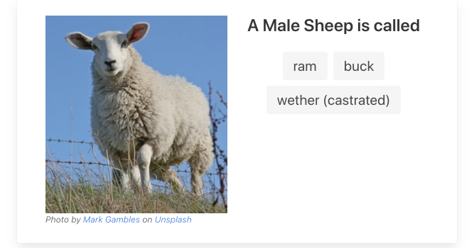
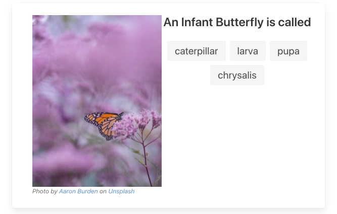
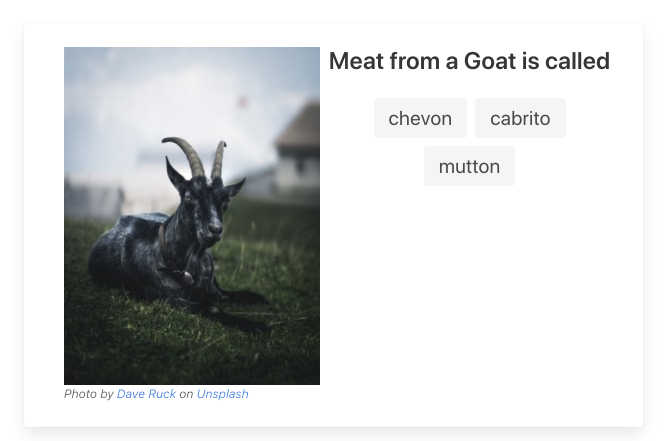

# Is Called

Playing around with Cloudflare pages and workers to expose animal facts.

Check it out at [what.iscalled.com](http://what.iscalled.com) 


Data is originally pulled from the [List of Animal Names](https://en.wikipedia.org/wiki/List_of_animal_names) Wikipedia entry, but has been tweaked to add a few entries here and there. 

Examples of information available below :

| Animal    | Type   | URL                                                                   | Screenshot                                                                               | 
| ---       | ---    | ---                                                                   | ---                                                                                      | 
| Snake     | Group  |[snake.group.iscalled.com](http://snake.group.iscalled.com/)           |            |
| Bear      | Female |[bear.female.iscalled.com](http://bear.female.iscalled.com/)           |            |
| Sheep     | Male   |[sheep.male.iscalled.com](http://sheep.male.iscalled.com/)             |             |
| Butterfly | Infant |[butterfly.infant.iscalled.com](http://butterfly.infant.iscalled.com/) |  | 
| Goat      | Meat   |[goat.meat.iscalled.com](http://goat.meat.iscalled.com/)               |                |

Additional information/animals are welcome, just submit a PR for the [Animals CSV](https://github.com/sam-heller/Is-Called/blob/main/build/wikipedia.csv).

## Data Setup

Copy the .env.example file into .env, and replace the following values
```bash
ACCOUNT_ID=<CLOUDFLARE ACCOUNT ID>
NAMESPACE_ID=<CLOUDFLARE KV NAMESPACE ID>
API_EMAIL=<CLOUDFLARE API EMAIL ADDRESS>
API_TOKEN=<CLOUDFLARE API TOKEN>
```

In order to update the Cloudflare KV store with the animal data, run the build script
```bash
 % npm run build

> @1.0.0 build /Users/name/Dev/Is-Called
> npm run buildData && npm run saveData

> @1.0.0 buildData /Users/name/Dev/Is-Called
> node build/setup.js build_data

> @1.0.0 saveData /Users/name/Dev/Is-Called
> node build/setup.js save_data

response setting bulk values :  { result: null, success: true, errors: [], messages: [] }
```

## HtmlRewrite Handlers
Content is generated via the [HTML Rewrite Handlers](https://developers.cloudflare.com/workers/runtime-apis/html-rewriter) defined in [workers-site/HtmlRewriteHandlers.js](https://github.com/sam-heller/Is-Called/blob/main/workers-site/HtmlRewriteHandlers.js). 
### DataElementHandler
Handles construction of the endpoint specific data, all it needs is the data object stored in the Cloudflare KV Store.
### ListingElementHandler
Builds the interface for the main page at what.iscalled.com. It pulls it's data from a listing of animal names stored in KV with the key `animals`
### MetadataHandler
Populates any html metadata entries on the page. Specific elements are matched via a case statement in the handlers element() function
### LdJsonHandler
Populates the [LdJson](https://json-ld.org/) object for the page. 
### DeleteElementHandler
Deletes any matched elements. Currently used to remove metadata for the site listing page. 